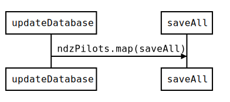

# Project Birdnest – Backend
This is a [pre-assignment](https://assignments.reaktor.com/birdnest/) for a Reaktor Developer Trainee application. This project is licensed under MIT License.

Take a look at the app [here](https://spring-moon-3266.fly.dev/).

This is the backend repository. You can find the frontend [here](https://github.com/ismomehdi/birdnest-frontend).

## Folder Structure

- The main imported functions are in the `src` directory.
- The `lib` directory contains services that are used by the `src` and the `index.js`.
- The `models` directory contains database models.
- The `util` directory contains general configuration.

## Backend Logic

- The `index.js` sets a 2 second interval to repeatedly call `updateDatabase`.
- Then `updateDatabase` calls `scrapeAndParse` which pulls the drone/pilot data from the API and returns the processed data to `updateDatabase`.

- Next `updateDatabase` uses the map function to call `SaveAll` on every pilot in the nzdPilots array.
- `SaveAll` saves all the pilots in the database.
- `SaveAll` checks if the data contains a new `closestDistance`. If it finds one, it saves it to the database.

- The `index.js` uses a [websocket](https://github.com/websockets/ws) to establish a connection to the frontend.
- When the connection is ready, the `index.js` calls `getAllFromDb` which returns the all needed data from the database.
- The data is then sent to the frontend via the websocket.
- The `index.js` sets a 2 second interval to repeatedly do this gathering and sending of data.

## Formula

The `filterByNDZ` function (from the `lib` directory) calculates whether or not a drone is within the NDZ. The result is calculated using the distance formula: 

$distance = sqrt((x2-x1)^2 + (y2-y1)^2)$

Coordinates (x1, y1) are the coordinates of the drone and (x2, y2) are the coordinates of the NDZ origin. The drone is within the NDZ if the distance is less than or equal to the radius of the NDZ.

## Database

- The database is provided by [MongoDB](https://www.mongodb.com/) and [Mongoose](https://mongoosejs.com/index.html) is used for interacting with it.
- The database automatically removes the pilot data in 10 minutes (since the document was last updated).
- The `closestDistance` collection is limited to only one document. That way whenever a new document is added, the old one is removed.

## Frontend

The `index.js` configures [Express](https://github.com/expressjs/express) to serve static files from the `build` directory, which contains the production build of the frontend.

Take a look at the frontend [here](https://github.com/ismomehdi/birdnest-frontend).

## Weaknesses

- MongoDB checks for expired documents every 60 seconds. As a result the pilot data could persist in the database slightly more than 10 minutes. Also, the workload [might affect the expiration time](https://www.mongodb.com/docs/manual/core/index-ttl/#timing-of-the-delete-operation).
- Proper unit tests are needed.
- Not mobile friendly, the data table doesn't translate well across smaller screens.

